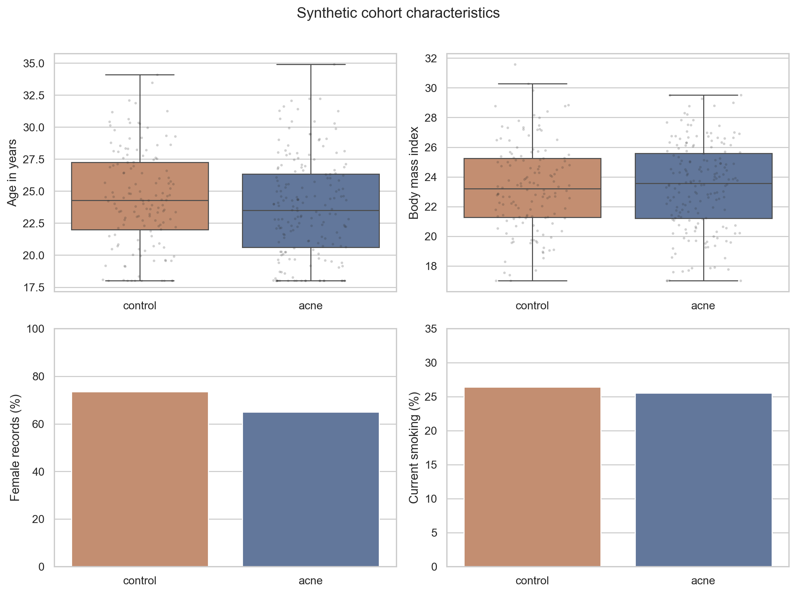
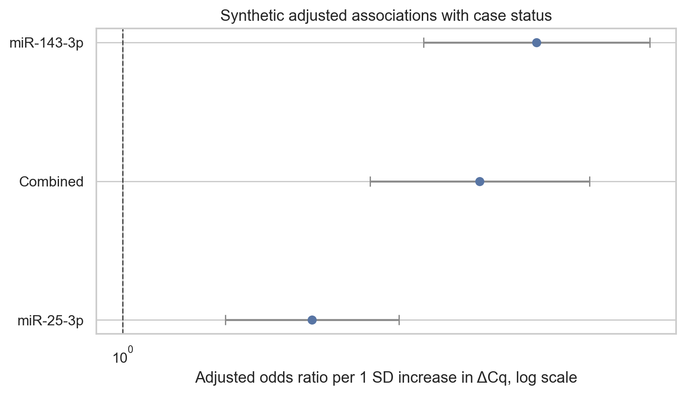
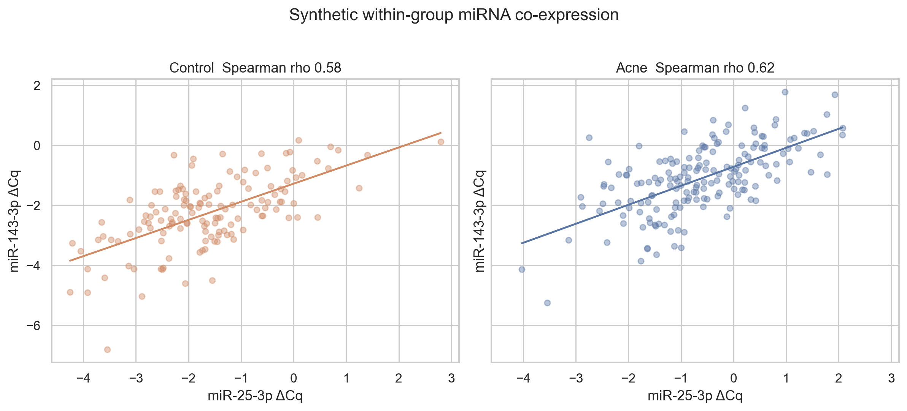

# Synthetic Dermatology miRNA Analysis

A reproducible clinical biomarker case study built with fully synthetic dermatology and qPCR data.

This project demonstrates an end-to-end analysis workflow for two miRNA measurements in synthetic acne and control groups. It covers data validation, qPCR normalization, statistical testing, effect-size estimation, adjusted association models, cross-validated discrimination, sensitivity analysis, and reproducible reporting.

> All records and numerical results are synthetic. Nothing in this repository comes from a patient, hospital, thesis dataset, or clinical study. The results have no medical or diagnostic meaning.


## Project highlights

- Reproducible generation of 320 synthetic clinical and qPCR records
- Validation of IDs, variables, missingness patterns, and assay quality flags
- Explicit interpretation of `ΔCq = Cq target - Cq reference`
- Reference-measurement stability checks before target interpretation
- Mann-Whitney U tests with rank-biserial effect sizes
- Bootstrap confidence intervals and Benjamini-Hochberg correction
- Spearman correlation and exploratory subgroup analysis
- Adjusted logistic regression with model diagnostics
- Stratified five-fold cross-validated ROC analysis
- Paired bootstrap comparison of AUC estimates
- Sensitivity, co-expression, and prospective power analyses

## Main notebook

[Open the executed analysis notebook](notebooks/synthetic_dermatology_mirna_case_study.ipynb)

The notebook generates the synthetic dataset from seed `20260915` and performs the complete analysis from beginning to end. It also exports the CSV tables and publication-style figures stored in this repository.

## Analysis overview

| Stage | Purpose |
|---|---|
| Synthetic cohort | Generate demographic, dermatology, and qPCR variables without protected data |
| Data validation | Check structure, IDs, missingness, derived fields, and QC flags |
| Reference assessment | Examine reference suitability before ΔCq interpretation |
| Primary analysis | Compare two miRNA ΔCq measures with effect sizes and uncertainty |
| Clinical analysis | Explore correlations and predefined binary subgroups |
| Adjusted models | Estimate associations with synthetic case status after covariate adjustment |
| Discrimination | Evaluate out-of-fold ROC performance using five-fold cross-validation |
| Robustness | Repeat key analyses after QC filtering and sample restriction |
| Co-expression | Compare group-specific Spearman correlations on the direct rho scale |
| Planning | Estimate sample sizes under several prospective effect assumptions |

## Synthetic result snapshot

The simulation contains a visible group signal so the workflow can be evaluated.

| Result | Estimate |
|---|---:|
| miR-25-3p cross-validated AUC | 0.72 |
| miR-143-3p cross-validated AUC | 0.77 |
| Two-miRNA cross-validated AUC | 0.77 |
| Direct difference in co-expression rho | 0.04 |
| Co-expression permutation p-value | 0.58 |

The deliberately unstable reference is a planned sensitivity example. It shows how unsuitable normalization can change the apparent direction of a target comparison.

## Selected outputs

### Synthetic cohort characteristics



### Primary ΔCq comparison


### Adjusted associations



### Cross-validated ROC curves


### Within-group co-expression



## Run locally

```bash
git clone https://github.com/elifbayindir/synthetic-dermatology-mirna-analysis.git
cd synthetic-dermatology-mirna-analysis
python -m venv .venv
source .venv/bin/activate
pip install -r requirements.txt
jupyter lab
```

Open `notebooks/synthetic_dermatology_mirna_case_study.ipynb` and run all cells.

## Repository structure

```text
.
├── README.md
├── requirements.txt
├── assets/
│   └── analysis-workflow.svg
├── data/
│   ├── README.md
│   └── synthetic_mirna_cohort.csv
├── figures/
├── notebooks/
├── tables/
└── session.json
```

## Scope and limitations

This repository is a methods demonstration. Synthetic IDs such as `SYN0001` do not refer to real people. Generated distributions should not be treated as prevalence estimates or biological evidence. The workflow is not a medical device and must not guide diagnosis, treatment, or clinical research conclusions.
