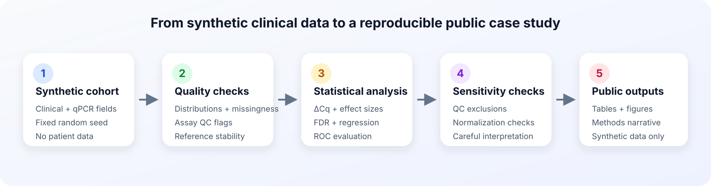
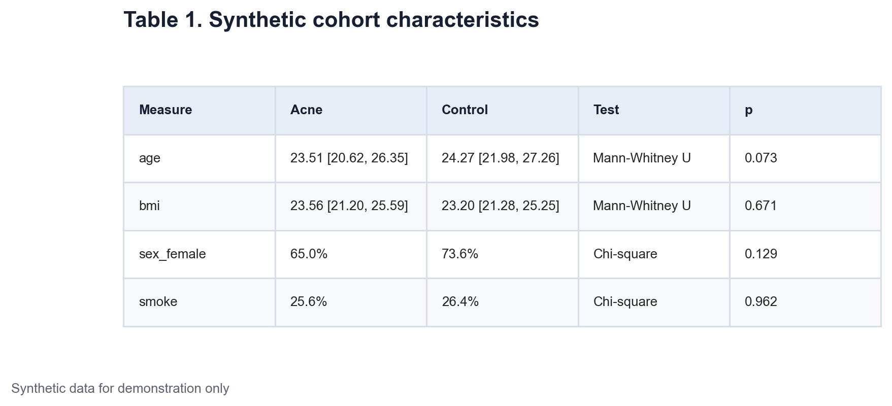
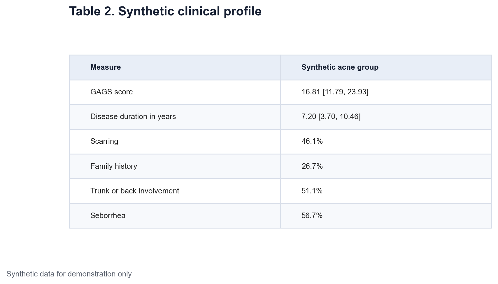
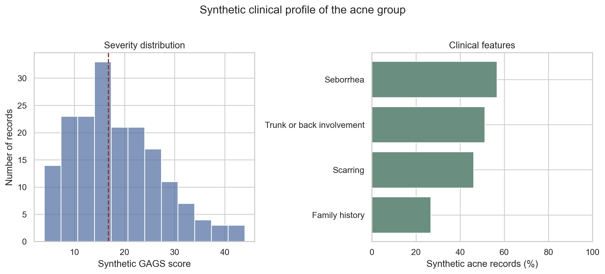

# Data Science - Medicine Application Project 1 Part 1

## Building a synthetic dermatology miRNA study

This is the first post in a five-part series about a small clinical data science workflow. The example studies two miRNA measurements in acne and control groups. Every record is synthetic. The numbers were generated from random distributions with a fixed seed. They do not come from patients, a thesis, a hospital, or a clinical study. None of the results should be read as medical evidence.

The goal is to show the work around a result. That includes the structure of the dataset, quality checks, the choice of statistical tests, uncertainty, and limits of interpretation. The complete workflow is available in one Jupyter notebook. Running the notebook rebuilds the data, tables, and figures used in this series.

## The analysis question

The synthetic study asks if reference-normalized miR-25-3p and miR-143-3p measurements differ between acne and control records. It also asks three secondary questions.

1. Are the miRNA measures related to clinical features within the acne group?
2. Do the group results remain similar after simple sensitivity checks?
3. How well do the measures separate synthetic acne and control records in cross-validation?

These are different statistical questions. A group comparison, a clinical correlation, and a prediction model should not be treated as the same result.

[Insert Figure 1 here using `figures/figure-01-analysis-workflow.svg`]

*Figure 1. Reproducible workflow used in the synthetic case study. The analysis moves from data generation and quality checks to statistical analysis, sensitivity checks, and public outputs. No patient data are used.*

## Creating the synthetic cohort

The cohort contains 320 generated records. There are 180 acne records and 140 control records. The random seed is fixed at 20260915, so the same package versions should recreate the same values.

The generated variables cover several common clinical data types.

- Continuous variables include age, body mass index, GAGS score, disease duration, age at onset, and qPCR Cq measurements.

- Binary variables include sex, smoking, scarring, family history, trunk or back involvement, and seborrhea.

- A categorical severity field is derived from the synthetic GAGS score.

- A quality flag marks records with a high target Cq value.

Clinical acne fields are left empty for control records because they are not applicable. This is structural missingness, not an accidental data loss. Menstrual irregularity is only generated for eligible synthetic records. The notebook checks these patterns before analysis.

The IDs use a form such as `SYN0001`. They have no link to a real person.

## Quality checks before statistics

The notebook verifies row count, unique IDs, allowed group labels, and the expected missingness pattern. It also confirms the mathematical relation between target Cq, reference Cq, and ΔCq. Eight of the 320 records receive a failed assay quality flag. They remain in the main analysis and are removed in a later sensitivity analysis.

This order matters. Statistical testing does not repair a duplicated ID, a wrong group label, or an incorrect derived variable.

## Describing the groups

Age and body mass index are summarized with the median and interquartile range. The Mann-Whitney U test compares their distributions between groups. This test does not require the values to follow a normal distribution and fits the descriptive approach used later for ΔCq.

Sex and smoking are binary variables. They are summarized as percentages and compared with Pearson's chi-square test. The cell counts are large enough for this approximation in the synthetic cohort.

[Insert Table 1 here using `tables/table-01-synthetic-cohort-characteristics.png`]

*Table 1. Demographic characteristics of the synthetic acne and control groups. Continuous variables are median [interquartile range]. Binary variables are percentages. P-values come from Mann-Whitney U or chi-square tests.*

The acne group has a median age of 23.51 years. The control median is 24.27 years. The p-value is 0.073. Median body mass index is 23.56 and 23.20, with a p-value of 0.671. Female records account for 65.0% of the acne group and 73.6% of the control group. Current smoking is close to 26% in both groups.

None of these comparisons gives strong evidence of a group difference. This does not prove that confounding is absent. Balance tests only describe the generated sample. Age, sex, body mass index, and smoking are still included in the adjusted models later in the series.

[Insert Figure 2 here using `figures/figure-02-synthetic-cohort-characteristics.png`]

*Figure 2. Age, body mass index, female sex, and current smoking in the synthetic groups. Box plots show the median and middle half of continuous values. Points show individual generated records.*

## Describing the acne records

The clinical profile is descriptive. No control comparison is possible for acne-specific features. The median synthetic GAGS score is 16.81, with an interquartile range from 11.79 to 23.93. Median disease duration is 7.20 years. Scarring is present in 46.1% of acne records, family history in 26.7%, trunk or back involvement in 51.1%, and seborrhea in 56.7%.

[Insert Table 2 here using `tables/table-02-synthetic-clinical-profile.png`]

*Table 2. Clinical profile of the synthetic acne group. Continuous measures are median [interquartile range]. Binary features are percentages.*

[Insert Figure 3 here using `figures/figure-03-synthetic-clinical-profile.png`]

*Figure 3. Distribution of the synthetic GAGS score and prevalence of four generated clinical features in the acne group. These values are teaching inputs, not prevalence estimates.*

This first stage gives the later tests a clear base. We know which rows are eligible for each question, which missing values are expected, and which variables describe the sample. Part 2 moves to qPCR normalization and the primary miRNA comparison.

