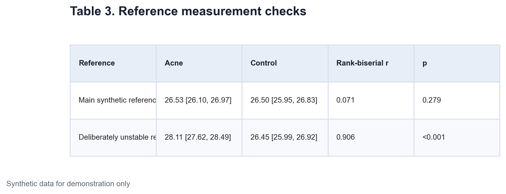
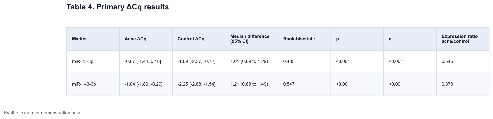
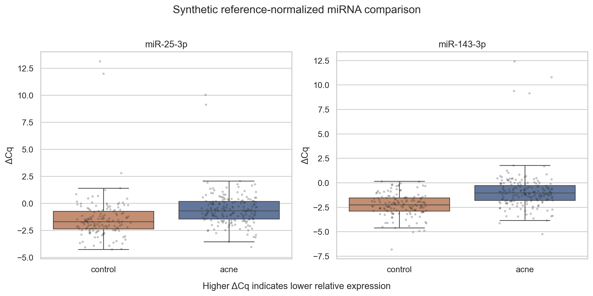
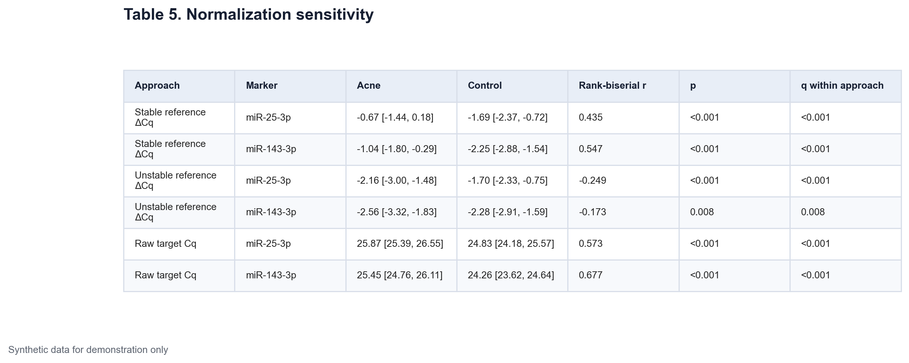
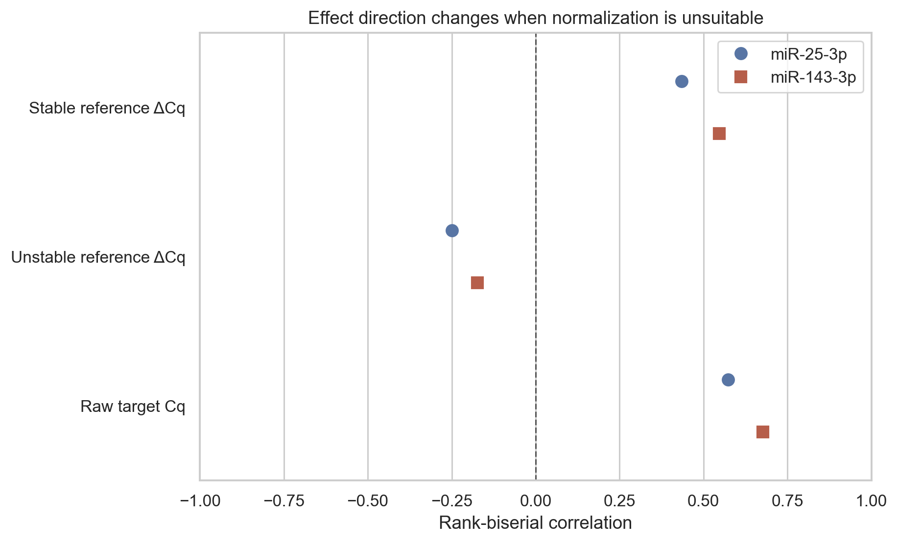

# Data Science - Medicine Application Project 1 Part 2

## From Cq values to the primary miRNA result

This post uses the synthetic cohort introduced in Part 1. Every measurement and result is generated for teaching. The analysis has no clinical or diagnostic meaning.

The main challenge in this section is interpretation. qPCR produces Cq values. The analysis uses a reference measurement to turn them into ΔCq values. A correct sign convention needs to be stated before comparing groups.

## What ΔCq means

The notebook defines ΔCq as

`ΔCq = Cq target - Cq reference`

A larger target Cq means that more amplification cycles were needed. With this definition, a higher ΔCq means lower relative target expression. A positive acne-minus-control ΔCq difference points to lower expression in the acne group.

The approximate relative expression ratio is calculated from the mean ΔΔCq as `2^(-ΔΔCq)`. A ratio below 1 also points to lower relative expression in acne records.

## Checking the reference measurement

Normalization is only useful if the reference behaves suitably for the comparison. The notebook tests the main synthetic reference in acne and control records with the Mann-Whitney U test. It also reports rank-biserial correlation as an effect size.

Rank-biserial correlation ranges from -1 to 1. A value near zero means substantial overlap between groups. Its sign follows the order used in the comparison.

The main reference has a median Cq of 26.53 in acne records and 26.50 in controls. Its rank-biserial estimate is 0.071 and the p-value is 0.279. This check does not prove perfect stability, but it does not show a clear group shift in this generated sample.

The notebook also contains a deliberately unstable reference. It was created only to demonstrate what an unsuitable reference can do. Its large group difference is visible in Table 3.

[Insert Table 3 here using `tables/table-03-reference-measurement-checks.png`]

*Table 3. Group checks for the main synthetic reference and a deliberately unstable teaching reference. Values are median [interquartile range]. The test is Mann-Whitney U and the effect size is rank-biserial correlation.*

## Choosing the primary test

The two ΔCq distributions are compared with the Mann-Whitney U test. This rank-based test is useful when a normal model is not assumed. It tests if values from one group tend to rank above values from the other group. It should not be described only as a test of medians.

Three additions make the result easier to read.

1. Each group is shown with its median and interquartile range.
2. The acne-minus-control median difference receives a percentile bootstrap 95% confidence interval.
3. Rank-biserial correlation describes the degree of separation on a scale from -1 to 1.

There are two prespecified primary marker tests. Their p-values are adjusted with the Benjamini-Hochberg method. The resulting q-values control the expected false discovery rate within this two-test family.

## Primary results

For miR-25-3p, median ΔCq is -0.67 in acne records and -1.69 in controls. The median difference is 1.01 with a bootstrap 95% confidence interval from 0.69 to 1.29. Rank-biserial correlation is 0.435. Both p and q are below 0.001.

For miR-143-3p, median ΔCq is -1.04 in acne records and -2.25 in controls. The median difference is 1.21 with a bootstrap interval from 0.88 to 1.49. Rank-biserial correlation is 0.547. Both p and q are below 0.001.

Both acne medians are higher. Under the stated ΔCq definition, both synthetic miRNAs have lower relative expression in the acne group. The estimated acne-to-control expression ratios are 0.545 for miR-25-3p and 0.378 for miR-143-3p.

[Insert Table 4 here using `tables/table-04-primary-delta-cq-results.png`]

*Table 4. Primary comparison of reference-normalized synthetic miRNA measurements. Positive median differences and positive rank-biserial estimates indicate higher ΔCq in acne records. Higher ΔCq means lower relative expression.*

[Insert Figure 4 here using `figures/figure-04-primary-delta-cq-comparison.png`]

*Figure 4. Reference-normalized ΔCq values for miR-25-3p and miR-143-3p in the synthetic groups. Boxes show the median and interquartile range. Points show generated records. Higher ΔCq indicates lower relative expression.*

## A planned normalization sensitivity example

The same targets are viewed in three forms. The first uses the stable reference. The second uses the deliberately unstable teaching reference. The third uses raw target Cq.

With the stable reference, both rank-biserial estimates are positive. With the unstable reference, they become negative. The unstable reference changes the apparent direction because its own Cq values differ strongly between groups. Raw target Cq values show a positive group effect, but they do not account for sample-level reference variation.

[Insert Table 5 here using `tables/table-05-normalization-sensitivity.png`]

*Table 5. Synthetic target comparisons under stable-reference normalization, deliberately unsuitable normalization, and raw Cq analysis. The unstable-reference rows are a planned warning example, not an alternative final result.*

[Insert Figure 5 here using `figures/figure-05-normalization-sensitivity.png`]

*Figure 5. Rank-biserial effect estimates under three analysis views. The sign changes under the deliberately unstable reference, showing why reference suitability is checked before biological interpretation.*

The primary result is not a statement about real acne biology. It is a successful test of the analysis logic. The direction follows the ΔCq definition, the reference check comes first, and uncertainty is shown next to significance. Part 3 looks at clinical correlations and exploratory subgroups.

