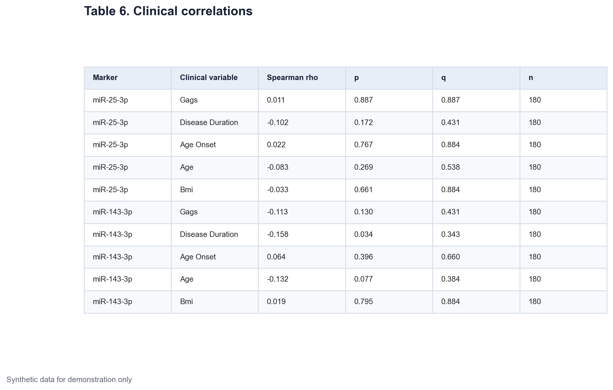
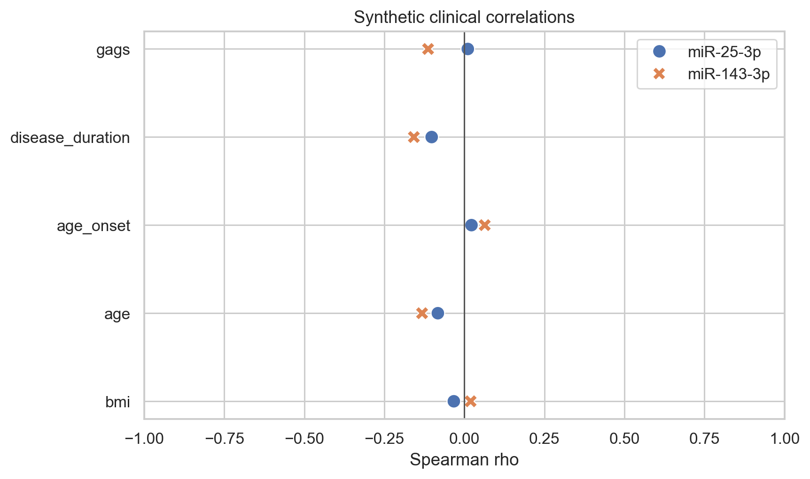
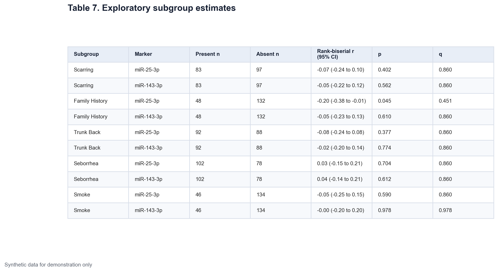
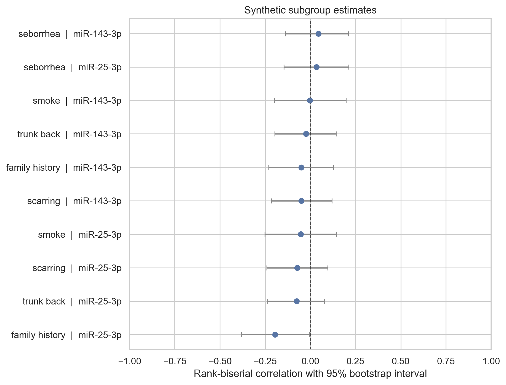

# Data Science - Medicine Application Project 1 Part 3

## Clinical associations and exploratory subgroups

The primary analysis compared synthetic acne and control records. This part stays within the generated acne group and asks if miRNA ΔCq values vary with clinical features. All data are synthetic and no result is medical evidence.

Secondary analyses are easy to overread. Many tests create more chances for a small p-value to appear. This notebook separates the clinical correlation family from the subgroup family and applies Benjamini-Hochberg correction within each family.

## Clinical correlations

Five clinical variables are paired with each of two miRNA measures. This gives ten correlations. The variables are GAGS score, disease duration, age at onset, current age, and body mass index.

Spearman correlation is used because it measures a monotonic association based on ranks. It does not require a linear relation or normally distributed variables. The coefficient rho ranges from -1 to 1. Values near zero suggest little monotonic association. The sign describes direction, not causality.

The analysis uses complete pairs for each correlation. In this generated dataset, all 180 acne records are available for these measures.

[Insert Table 6 here using `tables/table-06-clinical-correlations.png`]

*Table 6. Spearman correlations between synthetic miRNA ΔCq and five clinical variables in the acne group. Q-values use Benjamini-Hochberg correction across the ten correlations.*

Most estimates are small. The largest absolute estimate is the association between miR-143-3p ΔCq and disease duration. Its rho is -0.158 and its unadjusted p-value is 0.034. After correction across the ten tests, q is 0.343. It is not retained as a clear signal.

This is a useful example of why adjusted values matter. A nominal p-value below 0.05 can appear in an exploratory family even when the broader pattern is weak. The estimate and its context carry more information than a threshold label.

[Insert Figure 6 here using `figures/figure-06-clinical-correlations.png`]

*Figure 6. Spearman rho estimates for two synthetic miRNA measures and five clinical variables. The vertical line marks no rank correlation. The plot emphasizes the size and direction of each estimate.*

## Binary subgroup comparisons

The next section compares miRNA ΔCq within five synthetic clinical subgroups. The features are scarring, family history, trunk or back involvement, seborrhea, and smoking. Each feature is tested for both markers, giving ten comparisons.

The Mann-Whitney U test is used because each comparison has two independent groups and no normal distribution is assumed. Rank-biserial correlation is reported as the effect size. Here it describes how often a value from the feature-present group ranks above a value from the feature-absent group, adjusted to a scale from -1 to 1.

The 95% confidence intervals come from bootstrap resampling within the two subgroup levels. Benjamini-Hochberg correction is applied across all ten subgroup tests.

[Insert Table 7 here using `tables/table-07-subgroup-estimates.png`]

*Table 7. Exploratory comparisons of synthetic miRNA ΔCq by five binary clinical features. Effect sizes are rank-biserial correlations with bootstrap 95% confidence intervals. Q-values cover the ten-test subgroup family.*

The family-history comparison for miR-25-3p has an unadjusted p-value of 0.045 and a rank-biserial estimate of -0.20. Its q-value is 0.451. The interval is close to zero and the corrected result does not support a stable subgroup finding. The other estimates are also small, and all q-values are above 0.05.

[Insert Figure 7 here using `figures/figure-07-subgroup-estimates.png`]

*Figure 7. Rank-biserial estimates and bootstrap 95% confidence intervals for the synthetic subgroup comparisons. The vertical line marks no group separation. Wide intervals show the uncertainty in these secondary estimates.*

## What these results add

The synthetic markers were generated with a case-control signal. They were not generated with strong links to severity or the binary clinical features. The analysis recovers that structure. The main group difference can be clear while within-case clinical associations remain weak.

That distinction is important in biomarker work. A measure that differs between case and control groups does not automatically track severity, duration, or phenotype. Each claim needs its own design and test.

These analyses are exploratory. They can help generate a future question, but they should not be used to select a subgroup and then present it as if it had been planned in advance. Part 4 moves from group comparisons to adjusted association models and cross-validated discrimination.

