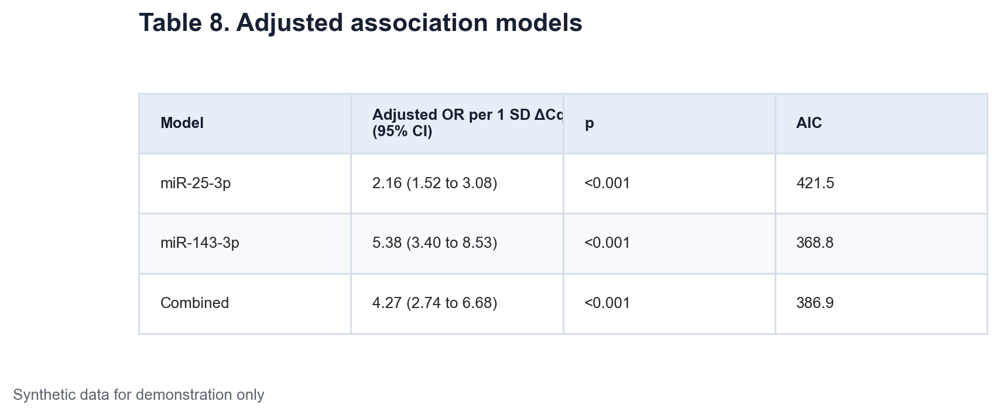
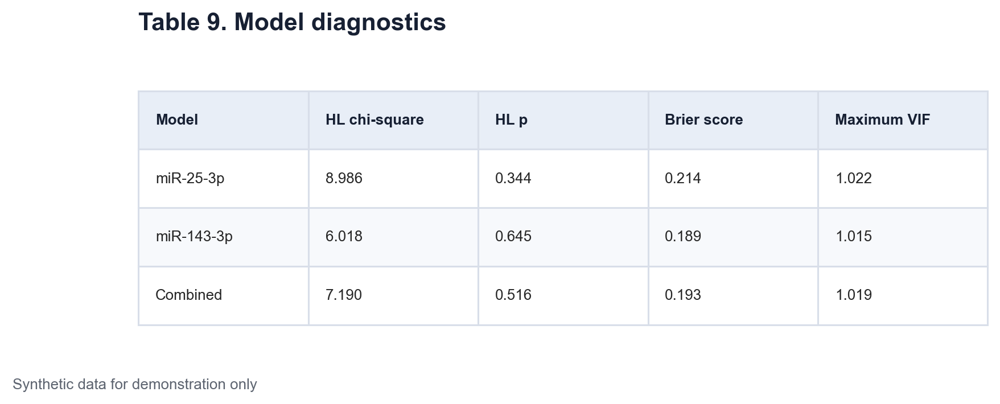
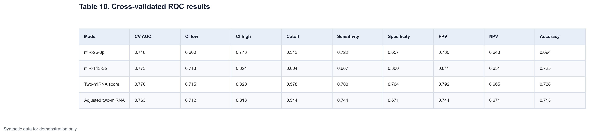
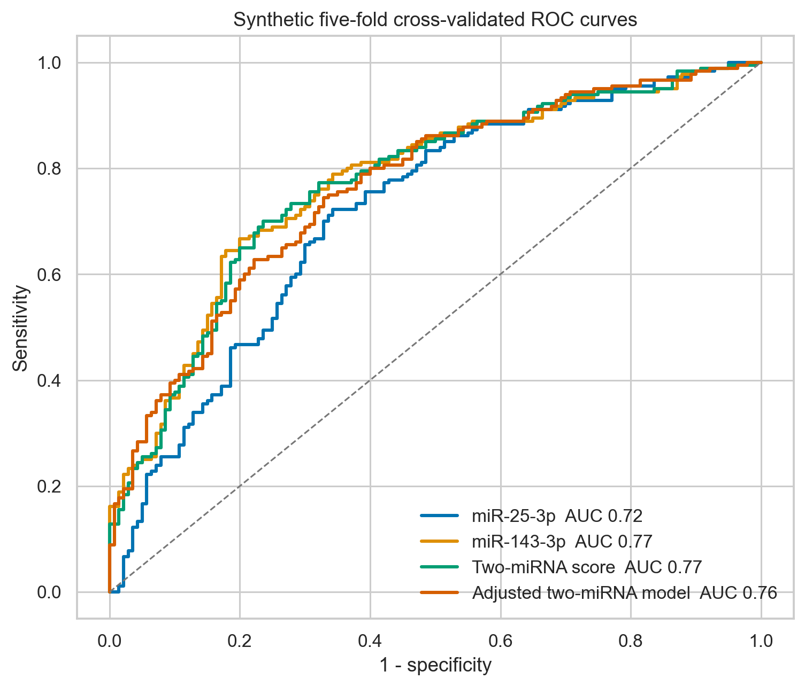
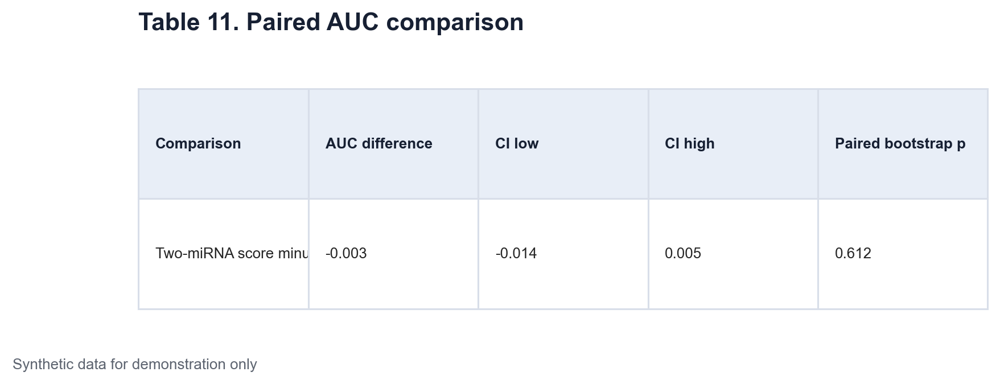

# Data Science - Medicine Application Project 1 Part 4

## Adjusted models and cross-validated discrimination

This part asks two related questions. First, are the synthetic miRNA measurements associated with case status after adjustment for basic covariates? Second, how well do the measurements separate generated acne and control records in cross-validation? These are association and discrimination questions. They do not establish causation, diagnosis, or clinical utility.

Every value in this post comes from synthetic data.

## Adjusted logistic regression

The outcome is binary case status. Logistic regression models the log odds of being in the synthetic acne group. Age, sex, body mass index, and smoking are included as covariates.

Each miRNA ΔCq measure is standardized across the full synthetic cohort. One unit in the reported odds ratio equals one standard deviation higher ΔCq. Since higher ΔCq means lower relative expression, an odds ratio above 1 links lower relative expression with higher odds of synthetic case status.

Three models are fitted.

1. miR-25-3p with the four covariates
2. miR-143-3p with the four covariates
3. The mean of the two standardized miRNA values with the four covariates

The miR-25-3p odds ratio is 2.16 with a 95% confidence interval from 1.52 to 3.08. The miR-143-3p odds ratio is 5.38 with an interval from 3.40 to 8.53. The combined score odds ratio is 4.27 with an interval from 2.74 to 6.68. All three p-values are below 0.001.

[Insert Table 8 here using `tables/table-08-adjusted-association-models.png`]

*Table 8. Adjusted associations between standardized synthetic ΔCq measures and case status. Models include age, sex, body mass index, and smoking. Odds ratios describe association per one standard deviation higher ΔCq.*

[Insert Figure 8 here using `figures/figure-08-adjusted-odds-ratios.png`]

*Figure 8. Adjusted odds ratios with 95% confidence intervals on a logarithmic scale. The vertical line at 1 marks no adjusted association.*

Akaike information criterion is also shown. Lower AIC indicates a better trade-off between fit and model complexity among models fitted to the same outcome and rows. The miR-143-3p model has the lowest AIC in this synthetic example. AIC is not a measure of clinical validity.

## Basic model diagnostics

The Hosmer-Lemeshow statistic compares observed and expected events across groups of predicted probabilities. A large p-value does not prove that a model is well calibrated. It only means this grouped check did not detect a clear discrepancy.

The Brier score is the mean squared error of predicted probabilities. Lower values indicate smaller probabilistic error. The variance inflation factor checks linear redundancy among predictors. Values close to 1 show little collinearity in these model matrices.

[Insert Table 9 here using `tables/table-09-model-diagnostics.png`]

*Table 9. Descriptive diagnostics for the three synthetic logistic models. HL denotes the Hosmer-Lemeshow grouped calibration check. Lower Brier scores indicate smaller probability error. VIF denotes variance inflation factor.*

The Hosmer-Lemeshow p-values range from 0.344 to 0.645. Brier scores range from 0.189 to 0.214. Maximum VIF values are close to 1.02. These checks show no obvious numerical warning in the synthetic models, but external validation would still be needed in a real prediction study.

## Out-of-fold ROC analysis

A model can look too good when it is assessed on the same rows used for fitting. This workflow uses stratified five-fold cross-validation. The data are split into five parts with similar case proportions. Each fold is predicted by a model trained on the other four folds. Combining these held-out predictions gives one out-of-fold probability for every record.

Four feature sets are compared.

- miR-25-3p alone

- miR-143-3p alone

- Both miRNAs

- Both miRNAs with age, sex, body mass index, and smoking

Within each training fold, missing numeric values are replaced by the training median and predictors are standardized. Logistic regression then produces the probability estimates.

Area under the ROC curve measures ranking discrimination. An AUC of 0.5 reflects chance-level ranking and 1.0 reflects perfect ranking in the evaluated sample. Bootstrap intervals describe uncertainty in the out-of-fold estimate.

The threshold is selected with Youden's J statistic, which maximizes sensitivity plus specificity minus 1. The reported threshold metrics are illustrative because the operating point is selected from the same pooled out-of-fold predictions. A deployed model would need a threshold chosen and tested under a separate validation plan.

[Insert Table 10 here using `tables/table-10-cross-validated-roc.png`]

*Table 10. Five-fold out-of-fold discrimination and threshold metrics for four synthetic models. Confidence intervals for AUC use bootstrap resampling. PPV and NPV depend on the generated case proportion.*

The cross-validated AUC is 0.718 for miR-25-3p and 0.773 for miR-143-3p. The two-miRNA score has an AUC of 0.770. Adding demographic covariates gives an AUC of 0.763. More predictors do not improve performance in this generated sample.

[Insert Figure 9 here using `figures/figure-09-cross-validated-roc.png`]

*Figure 9. ROC curves built from five-fold out-of-fold predictions. The diagonal line marks chance-level ranking. These curves describe the synthetic sample and are not clinical validation.*

## Comparing two AUC values directly

The two-miRNA and miR-143-3p predictions belong to the same records, so their AUC estimates are paired. The notebook resamples record indices and recalculates both AUC values in each bootstrap sample. It then stores their difference.

The observed AUC difference is -0.003. The 95% bootstrap interval runs from -0.014 to 0.005, and the paired bootstrap p-value is 0.612. The added marker does not show a clear improvement over miR-143-3p alone in this simulation.

[Insert Table 11 here using `tables/table-11-paired-auc-comparison.png`]

*Table 11. Paired bootstrap comparison of the two-miRNA score and miR-143-3p alone. A negative value means the two-miRNA score has a slightly lower AUC in this generated sample.*

The models are useful demonstrations of workflow, not candidate diagnostic tools. Part 5 checks the stability of the group results, compares miRNA co-expression, and turns assumed effect sizes into a simple prospective sample-size plan.

