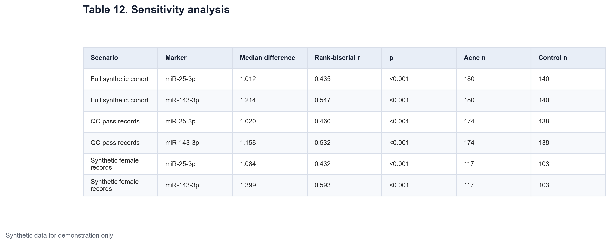
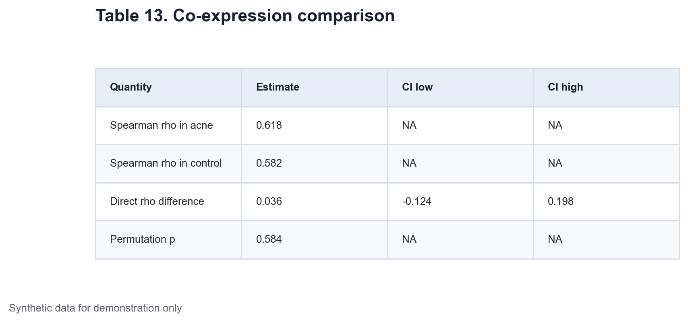
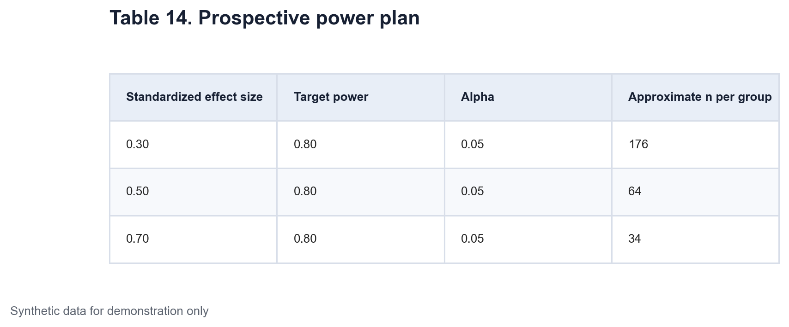

# Data Science - Medicine Application Project 1 Part 5

## Sensitivity, co-expression, and planning the next study

The final part asks how much the synthetic conclusions depend on simple analysis choices. It also compares the relationship between the two miRNAs across groups and shows a prospective power calculation. The data and results remain fully synthetic.

## Sensitivity analysis

A sensitivity analysis repeats the primary comparison under plausible changes to the eligible sample. A stable direction across these scenarios is more informative than one isolated p-value.

The Mann-Whitney U comparison and rank-biserial effect size are repeated in three samples.

1. The full synthetic cohort
2. Records that pass the assay quality rule
3. Synthetic female records

The full cohort has 180 acne and 140 control records. The quality check removes eight rows, leaving 174 acne and 138 controls. The female analysis includes 117 acne and 103 control records.

[Insert Table 12 here using `tables/table-12-sensitivity-analysis.png`]

*Table 12. Primary synthetic ΔCq comparisons in the full cohort, the assay QC-pass sample, and female records. Positive median differences and rank-biserial estimates indicate higher ΔCq and lower relative expression in acne records.*

For miR-25-3p, the median difference ranges from 1.01 to 1.08 and rank-biserial correlation ranges from 0.432 to 0.460. For miR-143-3p, the median difference ranges from 1.16 to 1.40 and the effect size ranges from 0.532 to 0.593. Every scenario keeps the same direction and each p-value is below 0.001.

This does not validate the result. The data were generated to contain a signal. It shows that the code gives a similar answer after two prespecified sample changes.

## Comparing within-group co-expression

The two ΔCq measures can be correlated within each group. Spearman rho is used because the question concerns rank association and does not require a linear normal model.

The QC-pass sample is used. The synthetic acne correlation is 0.618 and the control correlation is 0.582. Both show a positive within-group relationship.

The target quantity is the direct difference

`rho acne - rho control`

Its estimate is 0.036. A bootstrap confidence interval is built by resampling paired miRNA measurements independently within each group. The 95% interval runs from -0.124 to 0.198.

The p-value comes from a permutation test. Group labels are shuffled while the two measurements from each record remain paired. In each permutation, both group correlations and their difference are recalculated. The two-sided permutation p-value is 0.584.

[Insert Table 13 here using `tables/table-13-coexpression-comparison.png`]

*Table 13. Group-specific Spearman correlations and their direct difference in the synthetic QC-pass sample. The confidence interval uses independent within-group bootstrap resampling. The p-value uses label permutation.*

[Insert Figure 10 here using `figures/figure-10-coexpression.png`]

*Figure 10. Relationship between synthetic miR-25-3p and miR-143-3p ΔCq within control and acne records. Lines are simple visual guides. Inference uses Spearman correlation, bootstrap resampling, and permutation.*

The interval includes zero and the permutation result is not small. This generated sample does not give clear evidence that the two group correlations differ. Similar-looking coefficients should still be compared directly if the scientific question concerns their difference.

## Prospective power planning

Post-hoc power is not used to explain the observed results. Once an estimate and confidence interval are known, observed power adds little. The notebook instead asks what a future balanced two-group study might require under several assumed standardized effects.

The calculation uses a two-sided independent-samples t test, alpha 0.05, target power 0.80, and equal group sizes. It is a planning example. A real qPCR study would use assay-specific variance estimates, a chosen primary endpoint, an allowance for failed samples, and a clear plan for multiple testing.

[Insert Table 14 here using `tables/table-14-prospective-power-plan.png`]

*Table 14. Approximate sample size per group for a future balanced two-group study under three assumed standardized effect sizes. Calculations use a two-sided independent t test with alpha 0.05 and 80% power.*

A standardized effect of 0.30 needs about 176 records per group. An effect of 0.50 needs about 64 per group. An effect of 0.70 needs about 34 per group. Smaller expected effects require much larger samples.

## What the complete project demonstrates

This five-part example keeps the statistical tasks separate.

- Data validation comes before testing.

- The ΔCq definition determines the direction of expression.

- Reference suitability is checked before normalization is interpreted.

- Effect sizes and confidence intervals sit next to p-values.

- Primary and exploratory test families receive separate multiplicity control.

- Adjusted association is not described as causation.

- Prediction is evaluated with out-of-fold estimates.

- Correlation differences are tested on the direct rho scale.

- Future sample size is based on assumed effects, not post-hoc power.

The synthetic numbers are not the product. The product is a reproducible way to move from a clinical-style question to code, checks, tables, figures, and restrained interpretation without sharing protected data.

